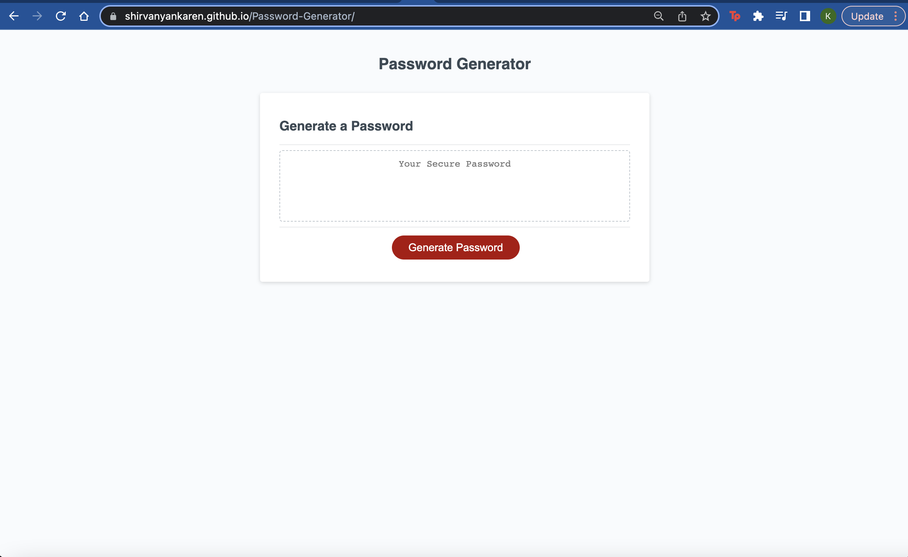
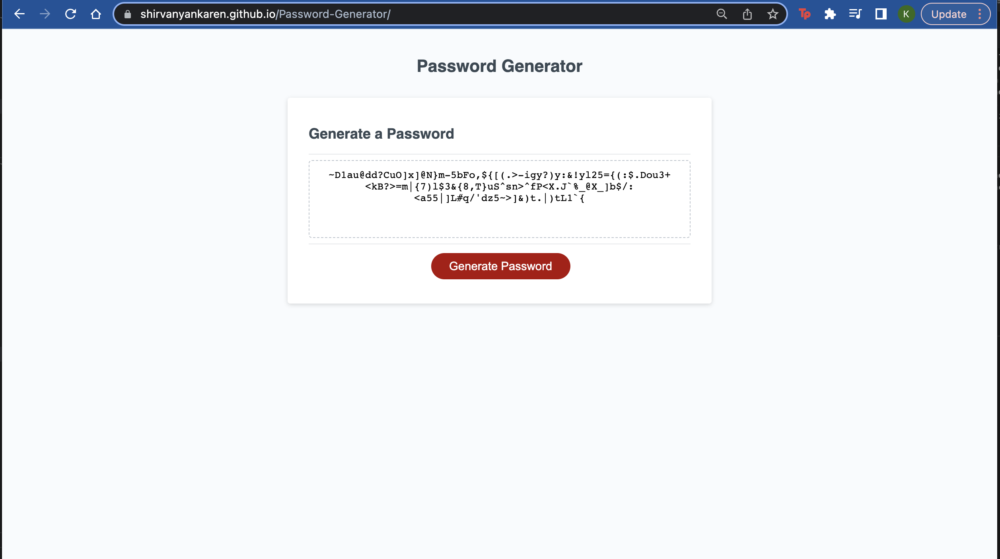

# Password-Generator

## Technology Used, Deployment, and Repository

| Technology Used         | Resource URL           | 
| ------------- |:-------------:| 
| Javascript    | [https://developer.mozilla.org/en-US/docs/Web/HTML](https://developer.mozilla.org/en-US/docs/Web/HTML) |   
| Git | [https://git-scm.com/](https://git-scm.com/)     | 
| Deployed Site | [https://shirvanyankaren.github.io/Password-Generator/](https://shirvanyankaren.github.io/Password-Generator/)     | 
| My Github Repository | [https://github.com/ShirvanyanKaren/Password-Generator](https://github.com/ShirvanyanKaren/Password-Generator/)     | 

## Description 
This project was an on-the-job ticket that had preset code within the HTML and CSS for a password generator, with the main objective being to enable the javascript to perform the function of creating a randomized password with the aplication meeting the following criteria:

GIVEN I need a new, secure password
WHEN I click the button to generate a password
THEN I am presented with a series of prompts for password criteria
WHEN prompted for password criteria
THEN I select which criteria to include in the password
WHEN prompted for the length of the password
THEN I choose a length of at least 8 characters and no more than 128 characters
WHEN asked for character types to include in the password
THEN I confirm whether or not to include lowercase, uppercase, numeric, and/or special characters
WHEN I answer each prompt
THEN my input should be validated and at least one character type should be selected
WHEN all prompts are answered
THEN a password is generated that matches the selected criteria
WHEN the password is generated
THEN the password is either displayed in an alert or written to the page

The finished application is presented by the image below:



## Table of Contents

* [Javascript Integration](#javascript)
* [Usage](#usage)
* [Learning Points](#learning-points)
* [Credits](#credits)
* [License](#license)

## Javascript Integration

To address the first portion of the criteria, I had to create several prompts for the user to choose a mandatory password length between 8 and 128 characters and at least one value from special characters, numbers, lower case, and upper case characters. This was, of course, after creating arrays of variables for them.

```js
// Must prompt used for password length (8-128) 
  var lengthPass = Number(prompt("How many characters would you like your password to be? Choose between 8-128?"));
  if (isNaN(lengthPass)) {
    alert("Input must be number");
    return null;
  }
  //Created a while loop if user doesn't meet sufficient requirements
  while (lengthPass < 8 || lengthPass > 128 || !lengthPass) {
    alert("Number must be between 8 and 128");
    return null;
  }

  // Confirm if user wants upper/lower, numbers and or special characters
  if (lengthPass => 8 && lengthPass <= 128) {
    var confirmUpper = confirm("Would you like to use upper case characters?");
    var confirmLower = confirm("Would you like to use lower case characters?");
    var confirmNum = confirm("Would you like to use numbers?");
    var confirmSpecial = confirm("Would you like to use special characters?");

  }
  // if no value is confirmed, prompt user to input at least one value
  while (!confirmNum && !confirmSpecial && !confirmLower && !confirmUpper) {
    alert("You have to select atleast one attribute.");
    var confirmUpper = confirm("Would you like to use upper case characters?");
    var confirmLower = confirm("Would you like to use upper case characters?");
    var confirmNum = confirm("Would you like to use numbers?");
    var confirmSpecial = confirm("Would you like to use special characters?");
  }
```

The prompt statement was utilized for the length of the password and confirm statements were used for the user's choice between the four character options. To accomodate for escape options, or invalid user inputs, I utilized if and while statements along with "return null" to return the user back to the questions if they don't meet these password generator requirements mentioned in the criteria. 

```js
var blankPass = [];

  //Created a randomizer for the confirms that ensures 
  if (confirmLower) {
    guaranteeChar = lowerChar[Math.floor(Math.random() * lowerChar.length)];
    blankPass.push(guaranteeChar);
  }
  if (confirmUpper) {
    guaranteeChar = upperChar[Math.floor(Math.random() * upperChar.length)];
    blankPass.push(guaranteeChar);
  }
  if (confirmNum) {
    guaranteeChar = numbersPass[Math.floor(Math.random() * numbersPass.length)];
    blankPass.push(guaranteeChar);
  }
  ...

  for (var i = blankPass.length; i < lengthPass; i++) {
    userOutput = availableChars[Math.floor(Math.random() * availableChars.length)]
    blankPass.push(userOutput)
    console.log(userOutput);
  }
```
The next step was to initiate a loop of the user's options with the reitiration of this loop based on the length they choose. To improve accuracy based on user criteria, I also included a guarantee variable with the first four iterations of the loop to ensure that the password includes all the character types issued by the user. I also included a shuffler at the bottom of the function to randomize the order, since the iteration of the loop will follow the particular order of the loop (meaning that the order of the character type will always follow the order of the loop otherwise). 
```js
//We push the blackPass var and join it to ("") so password can output the result as a string value which then becomes navigated to passwordText
  //shuffle blanpass as your own challenge
  var password = shuffle(blankPass);
  return password.join('');
  // console.log(password)
```
The final step was to insure that the password would be visible in the html presentation, which was done by pushing the output of the loop as into a "blank" string variable. This allows the password to be directed as a text value within the html.

## Usage
The usage of this password enables the user to generate a password with at least one character type within the given length criteria of 8 >=< 128 characters. The added features of the "guaranteedChar" variable and the shuffle function ensures that the order of the password is also random and that the password includes at least one of each character type chosen by the user. 



The following image shows how the execution of the password generator with all character types and the maximum 128 character length. 

## Learning Points

This was my first time creating an application with javascript and there were a lot of new skills and techniques I picked up along the way. I learned about functions, global scope variables, and for loops. One important aspect of this project that created a lot of complications for me was having the password display on the html file. I learned that the output of the function would have to be redefined as a text value decipherable by the html file, which is what I did with the  ```js return password.join('');``` portion of the code. I also learned a lot through implementing additional techniques like the shuffle fucntion. 

## Credits

Dennis Itua from the Central Tutor Center helped a lot with improving the functionality of the password generator and implementing the shuffle function and guaranteed character portion of the if statements.

## License 

MIT licensing with permisions such as commercial use, modification, distribution and private use. Limitations include liability and warranty.

